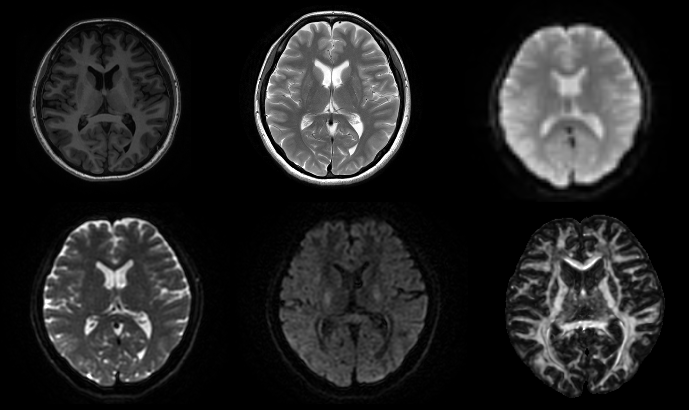
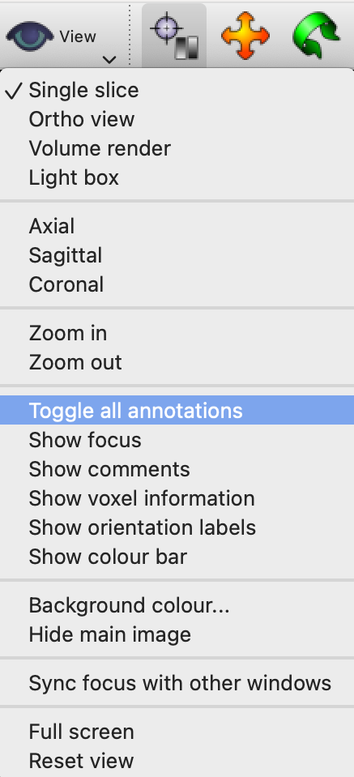
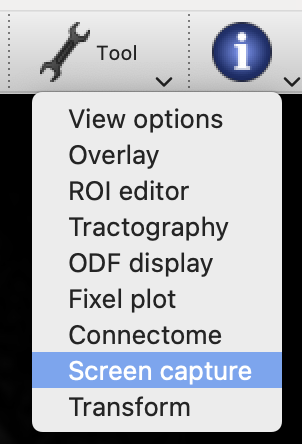
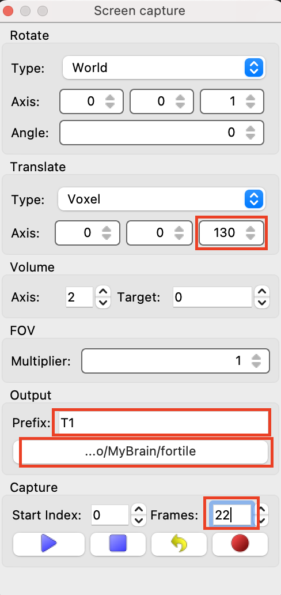
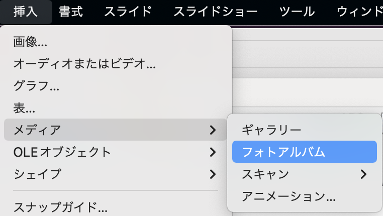

# tilemake

## DICOM（or NiFTI）画像を使ってPowerpoint スライドを作る



材料：DICOMファイル

道具：MRtrix3、FSL、tilemake.sh

* インストール方法はこちら

  * MRtrix3　<https://github.com/MRtrix3/homebrew-mrtrix3>
  * FSL <https://fsl.fmrib.ox.ac.uk/fsl/fslwiki/FslInstallation>

### 下ごしらえ

#### mrviewのscreencaptureを使ってスライドに載せたい画像のpngファイルを作る

1. DICOM画像の場合、NiFTIに変換しておく（dcm2niixなどを使う）
1. mrviewで開く
1. view→Toggle all annotationsで画面の文字やcrosshairを消す
1. 必要に応じて画像の調整（intensityや向きなど）
1. Tools→Screen captureを選ぶ

  

1. 横断像を同期してページングする（読影ビューアっぽい見た目にする）には上図のように設定する。
    1. 画像をスクロールして開始したい位置を表示する
    2. Translateの右端のボックス（Z軸）を終了位置に合わせた数値にする
    3. CaptureのStart Indexは0、Frames は欲しい枚数
    4. OutputのPrefixで画像の名前を決める（T2、DWIなど簡単な方がgood）
    5. 出力先のディレクトリを選ぶ
    6. 設定したら左下の三角ボタンでテストプレイを行い調整する
    7. 1-3の条件を揃えればスライス厚に関わらず位置を同期することができる
1. 録音ボタン（赤丸）でpngとして保存される。
1. １枚のスライドに載せたい画像を揃えたら下ごしらえ完了。

### 調理

#### tilemake.shを使ってタイル状に並んだpngファイルを作る

上記を保存したディレクトリを~/imgdirとすると

```bash
cp ~/Downloads/tilemake.sh ~/imgdir　#imgdirにコピー
cd ~/imgdir
chmod 755 tilemake.sh　#実行可能にする
bash tilemake.sh　#実行
```

- １画像あたり何枚のpngファイルがありますか?＞　には並べたい画像の1種類あたりの枚数を指定(上記だと22枚)
- 並べたい順に画像の名前をスペースで区切って入力して下さい＞　には並べたい画像の名前をスペース区切りで記載
  - ScreenCaptureで画像を保存した時のPrefix
  - 例)T1、T2
  - 2-6種類を選ぶ
- タイル状に並んだpngファイルがtilesフォルダ内に出力される。

### 仕上げ

#### できたタイル画像をパワーポイントに１枚ずつ貼る

PowerPointには複数画像を１枚ずつインポートするフォトアルバム機能があるが、Mac版にはない場合がある（地味な意地悪やめてほしい・・・）ので、LibreOfficeを使うのが楽。(こちら <https://ja.libreoffice.org> からダウンロードできる)
インストール後、Impressを開いて挿入＞メディア＞フォトアルバムを選ぶと１枚ずつ挿入できる。その後.pptx形式で保存すればPowerPointにスライドごとコピペできる。

